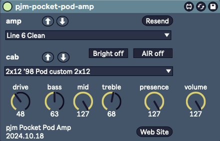

pjm-pocket-pod-amp - Max for Live device for the Line 6 Pocket Pod Amp
--------------------------------------------------------------------------------

This is a Max for Live MIDI Effect device. It is used to control the 
[Line 6 Pocket Pod][] Portable Guitar Processor.  Just the amp-y bits
however.  If you're using Live, you probably want to use Live effects,
not the ones on this device.

[Line 6 Pocket Pod]: https://line6.com/pocket-pod/

usage
================================================================================

Since this is a Max for Live MIDI Effect device, it needs to be added to a MIDI
track. That MIDI track will need to have it's output set to go to the Pocket Pod
MIDI port. I suggest creating a new track `Pocket Pod` with this device in it, and a
MIDI Monitor device before and after it, disabled, but ready to help out for
debugging if needed.

This device does not respond to MIDI messages from the device itself, for
instance if you twiddle some knobs.

Controls supported:

- amp model      
- amp cab        
- drive          
- presence       
- bright switch  
- noise gate     
- gate threshold 
- gate decay     
- air ambience   

The auto-mapped parameters for the device are set up as the following bank:

| control 1   | control 2     | control 3    | control 4   | control 5     | control 6   | control 7     | control 8  |   
|-------------|---------------|--------------|-------------|---------------|-------------|---------------|-------------
| amp up      | amp down      | cab up       | cab down    | presence      | drive       | gate threshold| gate decay |

changelog
================================================================================

version 2024.9.21

- initial version

references
================================================================================

- Line 6 Pocket Pod manuals, including the critical **MIDI Continuous Controller Reference**:

  https://line6.com/support/manuals/pocketpod

Pocket Pod Midi Implementation 
--------------------------------------------------------------------------------

This is a summary of the MIDI Continuous Controller Reference, specific
to the Pocket Pod

| name | cc   | value |
| ---- | ---- | ----- |
| tweak               |  1 | 0 ... 127 |
| wah position        |  4 | 0 ... 127 |
| volume pedal        |  7 | 0 ... 127 |
| amp model           | 12 | 0 ... 31 |
| drive               | 13 | 0 ... 127 |
| bass                | 14 | 0 ... 127 |
| mid                 | 15 | 0 ... 127 |
| treble              | 16 | 0 ... 127 |
| channel volume      | 17 | 0 ... 127 |
| reverb level        | 18 | 0 ... 127 |
| effect setup        | 19 | 0 ... 15 |
| drive 2             | 20 | 0 ... 127 |
| presence            | 21 | 0 ... 127 |
| noise gate          | 22 | 0 off, 127 on |
| gate threshold      | 23 | 32 ... 127 |
| gate decay          | 24 | 0 ... 127 |
| stomp enable        | 25 | 0 off, 127 on |
| comp enable         | 26 | 0 off, 127 on |
| presence boost      | 27 | 0 off, 127 on |
| delay enable        | 28 | 0 off, 127 on |
| delay param 1 MSB   | 30 | 0 ... 127 |
| delay regen         | 32 | 0 ... 127 |
| delay mix           | 34 | 0 ... 127 |
| reverb enable       | 36 | 0 off, 127 on |
| reverb model        | 37 | 0 ... 127 |
| reverb decay        | 38 | 0 ... 127 |
| reverb tone         | 39 | 0 ... 127 |
| reverb diffusion    | 40 | 0 ... 127 |
| reverb density      | 41 | 0 ... 127 |
| compression ratio   | 42 | 0 ... 127 |
| wah enable          | 43 | 0 off, 127 on |
| wah bottom          | 44 | 0 ... 127 |
| wah top             | 45 | 0 ... 127 |
| volume pedal min    | 46 | 0 ... 127 |
| volume pre/post     | 47 | 0 pre, 127 post |
| volume swell enable | 48 | 0 ... 127 |
| volume swell ramp   | 49 | 0 ... 127 |
| mod enable          | 50 | 0 off, 127 on |
| chorus/flange speed | 51 | 0 ... 127 |
| chorus/flange depth | 52 | 0 ... 127 |
| chorus/flange regen | 53 | 0 ... 127 |
| chrous predelay     | 54 | 0 ... 127 |
| rotary speed        | 55 | 0 ... 127 |
| rotary max speed    | 56 | 0 ... 127 |
| rotary min speed    | 57 | 0 ... 127 |
| tremelo speed       | 58 | 0 ... 127 |
| tremelo depth       | 59 | 0 ... 127 |
| delay time          | 62 | 0 ... 127 |
| tap tempo           | 64 | 127 tap |
| amp cab             | 71 | 0 ... 15 |
| air ambience        | 72 | 0 ... 127 |
| bright switch       | 73 | 0 ... 127 |

Amp Models (MIDI CC 12)
--------------------------------------------------------------------------------

| value | name | based on      |
| ----- | ---- | --------      |
|     0 | Tube Preamp          |
|     1 | Line 6 Clean         |
|     2 | Line 6 Crunch        |
|     3 | Line 6 Drive         |
|     4 | Line 6 Layer         |
|     5 | Small Tweed          | ’52 Fender Tweed Deluxe Reverb |
|     6 | Tweed Blues          | ’59 Fender Bassman 4x10 combo |
|     7 | Black Panel          | Fender Deluxe Reverb |
|     8 | Modern Class A       | Matchless Chieftain | 
|     9 | Brit Class A         | Vox AC 30 | 
|    10 | Brit Blues           | ’64 Marshall JTM-45 |
|    11 | Brit Classic         | Marshall Plexi | 
|    12 | Brit Hi Gain         | Marshall JCM 800 | 
|    13 | Treadplate           | ’94 Mesa/Boogie Dual Rectifier Tremoverb |
|    14 | Modern Hi Gain       | Soldano X88R | 
|    15 | Fuzz Box             | Arbiter Fuzz Face | 
|    16 | Jazz Clean           | Roland JC-120 |
|    17 | Boutique #1          | Dumble Overdrive Special Clean |
|    18 | Boutique #2          | Dumble Overdrive Special Drive |
|    19 | Brit Class A #2      | Boost Vox AC-30 | 
|    20 | Brit Class A #3      | ’60 Vox AC 15 | 
|    21 | Small Tweed #2       | ’60 Fender Tweed Champ |
|    22 | Black Panel #2       | ’65 Fender Twin Reverb | 
|    23 | Boutique #3          | Budda Twinmaster | 
|    24 | California Crunch #1 | Mesa/Boogie Mark II-C+ Clean |
|    25 | California Crunch #2 | Mesa/Boogie Mark II-C+ Drive |
|    26 | Treadplate #2        | ’95 Mesa/Boogie Dual Rectifier | 
|    27 | Modern Hi Gain #2    | Soldano SLO – Super Lead Overdrive | 
|    28 | Line 6 Twang         |
|    29 | Line 6 Crunch #2     |
|    30 | Line 6 Blues         | ’65 Marshall JTM-45 Bluesbreaker |
|    31 | Line 6 INSANE        |

Cab Models (MIDI CC 71)
--------------------------------------------------------------------------------

| value | name |
| ----- | ---- |
|     0 | 1x 8 ’60 Fender Tweed Champ |
|     1 | 1x12 ’52 Fender Tweed Deluxe |
|     2 | 1x12 ’60 Vox AC15 |
|     3 | 1x12 ’64 Fender Blackface Deluxe  |
|     4 | 1x12 ’98 Line 6 Flextone |
|     5 | 2x12 ’65 Fender Blackface Twin  |
|     6 | 2x12 ’67 VOX AC30 |
|     7 | 2x12 ’95 Matchless Chieftain |
|     8 | 2x12 ’98 Pod custom 2x12 |
|     9 | 4x10 ’59 Fender Bassman |
|    10 | 4x10 ’98 Pod custom 4x10 cab |
|    11 | 4x12 ’96 Marshall with V30s |
|    12 | 4x12 ’78 Marshall with 70s |
|    13 | 4x12 ’97 Marshall Basketweave with Greenbacks  |
|    14 | 4x12 ’98 Pod custom 4x12 |
|    15 | No Cabinet |
                                
Effects Models (MIDI CC 19)
--------------------------------------------------------------------------------

| value | name |
| ----- | ---- |
|     0 | Chorus2 |
|     1 | Flanger1 |
|     2 | Rotary |
|     3 | Flanger2 |
|     4 | Delay/Chorus1 |
|     5 | Delay/Tremolo |
|     6 | Delay |
|     7 | Delay/Comp |
|     8 | Chorus1 |
|     9 | Tremolo |
|    10 | Bypass |
|    11 | Compressor |
|    12 | Delay/Chorus2 |
|    13 | Delay/Flanger1 |
|    14 | Delay/Swell |
|    15 | Delay/Flanger2   |
